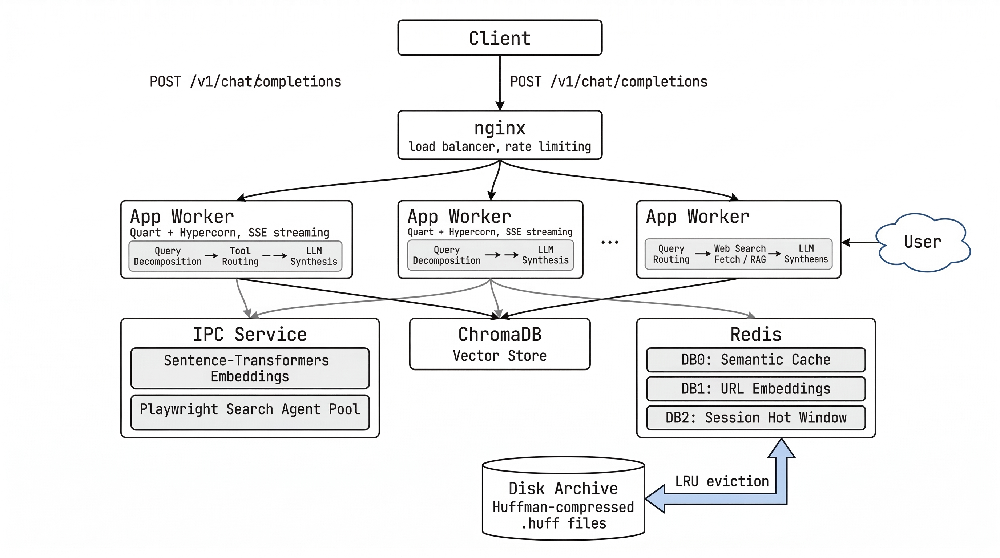
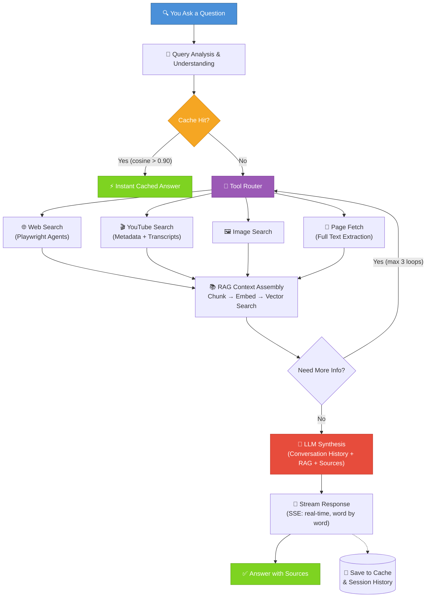

<div align="center">

# 🔍 lixSearch

**Intelligent search assistant with real-time web research, RAG, and OpenAI-compatible API**

[](https://opensource.org/licenses/MIT)
[](https://www.python.org/)
[](https://www.docker.com/)
[](#-api-usage)
[](https://redis.io/)
[](https://playwright.dev/)
[](https://pages.cloudflare.com/)

[](https://github.com/pollinations/lixSearch/stargazers)
[](https://github.com/pollinations/lixSearch/network)
[](https://github.com/pollinations/lixSearch/issues)
[](https://github.com/pollinations/lixSearch/commits/main)

<br/>

<a href="https://star-history.com/#pollinations/lixSearch&Date">
 <picture>
   <source media="(prefers-color-scheme: dark)" srcset="https://api.star-history.com/svg?repos=pollinations/lixSearch&type=Date&theme=dark" />
   <source media="(prefers-color-scheme: light)" srcset="https://api.star-history.com/svg?repos=pollinations/lixSearch&type=Date" />
   
 </picture>
</a>

<br/>



</div>

---

## ✨ What Makes lixSearch Different?

- Don't wait for search results. lixSearch remembers what you've already asked about and serves up answers instantly from its memory. Same question, instant answer.

- Unlike regular search engines, lixSearch understands what you're really asking for. It searches the web, watches YouTube videos, analyzes images, and pieces everything together into a coherent answer.

- Every answer comes with sources. Read the original articles, watch the videos, see exactly where the information came from. No fluff, no guessing.

- Ask a follow-up question and lixSearch remembers what you were just talking about. It's like chatting with someone who actually paid attention to the conversation.

---

## ⚙️ How It Works (In Plain English)

When you ask lixSearch a question, here's what happens behind the scenes:

1. **You Ask** - Type your question naturally, like you're talking to a friend
2. **We Understand** - lixSearch breaks down your question into its key parts
3. **We Search** - Multiple search agents fan out across the web, YouTube, and images simultaneously
4. **We Read** - Automatically extract the important information from articles and videos
5. **We Synthesize** - An AI reads through everything and writes a clear, concise answer
6. **You Get Results** - A beautifully formatted answer with clickable sources and relevant images


---

## 🌍 Real-World Use Cases

- Any NLP based model that has the ability to perform tools / function calling can use this 
- Completely self hosted, so you can run it on your own infrastructure and customize it to your needs on CPU
- Can surf youtube / web_images / indexed web pages to find information and synthesize it into a single answer
- Can be used as a backend for any search engine, chatbot, or assistant that needs to
  - Search the web for information
  - Find relevant videos and images
  - Synthesize information into a clear answer
  - Provide sources for all information
- Can be modified into single endpoints for specific use cases like:
  - Product search with reviews and images
  - Recipe search with videos and photos
  - News search with original sources and summaries
  - Location search with details, reviews, and photos


---

## 🛠️ How The System Works (The Simple Version)



**Result:** Fast, accurate answers you can trust.


---

## 🎁 Core Capabilities

| Capability | Implementation |
|-----------|---------------|
| **Real-time streaming** | Server-Sent Events (SSE) — tokens stream as they're generated, not buffered |
| **Semantic caching** | Redis DB0 with cosine similarity (threshold 0.90) — repeat queries resolve in <15ms |
| **Multi-turn memory** | Two-tier hybrid: Redis hot window (20 msgs) + Huffman-compressed disk archive (30-day TTL) |
| **Dynamic context** | Token-budget based history injection (6000 tokens) — model gets as much context as it needs |
| **Source attribution** | Every claim links to the original URL, with full-text extraction and relevance scoring |
| **Deep search mode** | Decomposes complex queries into sub-queries, runs parallel mini-pipelines, synthesizes a unified answer |

---

## 📖 API Usage

lixSearch exposes an **OpenAI-compatible** API. Any client that works with OpenAI works with lixSearch.

### Basic search
```bash
curl -X POST https://search.elixpo.com/v1/chat/completions \
  -H "Content-Type: application/json" \
  -d '{
    "messages": [{"role": "user", "content": "What is the best way to learn Python?"}],
    "stream": true
  }'
```

### Multi-turn conversation
```bash
curl -X POST https://search.elixpo.com/v1/chat/completions \
  -H "Content-Type: application/json" \
  -d '{
    "messages": [
      {"role": "user", "content": "What is the best way to learn Python?"},
      {"role": "assistant", "content": "Here are the top approaches..."},
      {"role": "user", "content": "What about free resources specifically?"}
    ],
    "stream": true
  }'
```
The full conversation history is injected into the model context — no session ID management needed.

### Non-streaming (JSON response)
```bash
curl -X POST https://search.elixpo.com/v1/chat/completions \
  -H "Content-Type: application/json" \
  -d '{
    "messages": [{"role": "user", "content": "Latest breakthroughs in AI"}],
    "stream": false
  }'
```
Returns a standard `chat.completion` object with `usage` (prompt/completion tokens) and `choices[0].message.content`.

### Deep search
```bash
curl -X POST https://search.elixpo.com/v1/chat/completions \
  -H "Content-Type: application/json" \
  -d '{
    "messages": [{"role": "user", "content": "Compare transformer architectures for long-context reasoning"}],
    "stream": true,
    "deep_search": true
  }'
```

### Available endpoints

| Endpoint | Method | Description |
|----------|--------|-------------|
| `/v1/chat/completions` | POST | OpenAI-compatible chat completions (stream + non-stream) |
| `/v1/models` | GET | List available models |
| `/api/search` | POST/GET | Legacy search endpoint (SSE) |
| `/api/stats` | GET | Redis memory, disk archive stats, session counts |
| `/api/health` | GET | Health check |
| `/docs` | GET | Interactive API documentation (Scalar UI) |

---


## ❓ Why Use lixSearch?

### vs. Regular Search Engines
- Better Understanding - Grasps what you really want, not just keyword matching
- Saves Time - One coherent answer instead of browsing 10 blue links
- Context Aware - Remembers what you were just talking about
- Multimedia - Automatically finds videos, images, and articles

### vs. ChatGPT
- Real-Time Info - Connected to the web, not using outdated training data
- Verified Sources - Every fact links to where it came from
- Fresher Results - Gets today's news, not last year's knowledge
- Faster - Streamed results, not waiting for a complete response

---

## 👥 Perfect For

- Students - Research papers, homework, learning topics  
- Professionals - Market research, industry updates, competitor analysis  
- Home Improvement - DIY guides, product reviews, how-to videos  
- Travelers - Travel planning, local info, reviews  
- Researchers - Deep dives with cited sources  
- News Junkies - Latest updates with original sources  

---

Each will give you a complete, sourced answer.


---

## ❔ FAQ

**How is this different from Google?**
Google gives you links. lixSearch gives you answers. We do the searching for you and synthesize a coherent response.

**Is my search history private?**  
Your privacy is important. [Link to privacy policy]

**Can I use this offline?**
lixSearch needs internet to search the web, but works faster when utilizing local cache.

**Why are my results sometimes general?**
Ask more specifically! "Vegan chocolate chip cookies" gives better results than "recipes."

---

## 🤝 Get Involved

Found a bug? Have ideas for improvement? 
[Contribute on GitHub](https://github.com/pollinations/lixSearch) | [Report Issues](https://github.com/pollinations/lixSearch/issues)

---

## 📧 Contact & Support

Questions? Feedback? Suggestions?  
- hello@elixpo.com  
- [lixSearch source](https://github.com/pollinations/lixSearch)  

---

**Happy Searching!**

> *lixSearch - Search smarter, not harder.* 
**Made with ❤️ by Elixpo**

