# lixSearch API Architecture

## API Endpoints

### Search Endpoint: `/api/search`
- **Methods**: `GET`, `POST`
- **Default Mode**: Streaming (SSE)

#### Parameters
| Parameter | Type | Default | Description |
|-----------|------|---------|-------------|
| `query` | string | required | Search query |
| `image_url` | string | optional | URL of image for visual search |
| `stream` | boolean | `true` | Stream results as Server-Sent Events |

#### Streaming Mode (`stream=true` or default)
Returns Server-Sent Events in OpenAI-compatible JSON format:
```bash
# GET request
curl "http://localhost:9002/api/search?query=latest%20news&stream=true"

# or POST request
curl -X POST -H "Content-Type: application/json" \
  -d '{"query":"latest news","stream":true}' \
  http://localhost:9002/api/search
```

Response format: `text/event-stream` with OpenAI-compatible JSON events
```
data: {"id":"chatcmpl-abc1","object":"chat.completion.chunk","created":1708014000,"model":"kimi","choices":[{"index":0,"delta":{"role":"assistant","content":"Searching for latest news..."},"finish_reason":null}],"event_type":"INFO"}

data: {"id":"chatcmpl-abc1","object":"chat.completion.chunk","created":1708014000,"model":"kimi","choices":[{"index":0,"delta":{"role":"content","content":"Found 5 relevant sources..."},"finish_reason":null}],"event_type":"final-part"}

data: {"id":"chatcmpl-abc1","object":"chat.completion.chunk","created":1708014000,"model":"kimi","choices":[{"index":0,"delta":{"role":"content","content":"\\n\\n**Sources:**\\n1. [URL](url)"},"finish_reason":"stop"}],"event_type":"final"}
```

Each event is a complete OpenAI-format JSON object that can be parsed consistently:
- **INFO events**: Status/progress updates
- **final-part events**: Content chunks (for large responses)
- **final events**: Last content chunk with `finish_reason: "stop"`
- **error events**: Error messages with `finish_reason: "error"`

#### Non-Streaming Mode (`stream=false`)
Returns single OpenAI-format JSON response:
```bash
# GET request
curl "http://localhost:9002/api/search?query=latest%20news&stream=false"

# or POST request
curl -X POST -H "Content-Type: application/json" \
  -d '{"query":"latest news","stream":false}' \
  http://localhost:9002/api/search
```

Response format: `application/json` (OpenAI chat completion format)
```json
{
  "id": "chatcmpl-abc123",
  "object": "chat.completion",
  "created": 1708014000,
  "model": "kimi",
  "choices": [{
    "index": 0,
    "message": {
      "role": "assistant",
      "content": "Response with \\n escaped newlines for parsing..."
    },
    "finish_reason": "stop"
  }],
  "usage": {
    "prompt_tokens": 0,
    "completion_tokens": 247,
    "total_tokens": 247
  }
}
```

### Response Format Consistency
Both streaming and non-streaming modes return **OpenAI-compatible JSON** for unified parsing:
- **Streaming**: Each SSE event is a complete OpenAI JSON object
- **Non-Streaming**: Final response is a single OpenAI JSON object
- **Newlines**: All responses escape `\n` for proper JSON parsing
- **Token Counting**: Both modes include accurate token counts via tiktoken
- **Models**: Both support the same model selection

## Module Hierarchies

```mermaid
graph TB
    subgraph Client["Client Layer"]
        HTTP[HTTP/REST Client]
        WS[WebSocket Client]
    end

    subgraph Entry["Entry Point"]
        APP_PY["app/main.py<br/>Server launcher"]
    end

    subgraph AppPackage["app Package"]
        MAIN["main.py<br/>lixSearch class<br/>- CORS setup<br/>- Middleware registration<br/>- Route registration<br/>- Lifecycle hooks"]
        
        UTILS["utils.py<br/>Utilities & Formatters<br/>- validate_query<br/>- validate_session_id<br/>- validate_url<br/>- setup_logger<br/>- format_openai_response<br/>- count_tokens"]
        
        subgraph Gateways["gateways/"]
            HEALTH["health.py<br/>Health check endpoint"]
            SEARCH_GW["search.py<br/>Search endpoint<br/>- Accepts GET/POST<br/>- Calls pipeline<br/>- Formats response<br/>- Returns OpenAI JSON"]
            SESSION_GW["session.py<br/>Session CRUD<br/>- create<br/>- get<br/>- delete<br/>- query KG"]
            CHAT_GW["chat.py<br/>Chat operations<br/>- chat<br/>- session chat<br/>- completions<br/>- history"]
            STATS_GW["stats.py<br/>Statistics endpoint"]
            WS_GW["websocket.py<br/>WebSocket search"]
        end
    end

    subgraph IPC["IPC Service (subprocess)"]
        CORE_SVC["CoreEmbeddingService"]
        SEARCH_AGENT["SearchAgents Manager"]
        EMBEDDINGS["Vector Store<br/>Chroma DB"]
        SEMANTIC["Semantic Cache"]
    end

    subgraph Pipeline["Pipeline Runner"]
        SEARCH_PIPE["SearchPipeline<br/>run_elixposearch_pipeline<br/>- SSE mode (event_id=set)<br/>- JSON mode (event_id=None)"]
        TOOLS["Tool Definitions<br/>web_search, fetch_full_text,<br/>image_search, query_cache<br/>get_local_time, etc."]
        INSTRUCTIONS["System Instructions<br/>markdown with \\n escaping<br/>Tool guidance<br/>Role definitions"]
        CONFIG["Pipeline Config<br/>Model settings<br/>Cache parameters<br/>API endpoints"]
    end

    subgraph Response["Response Processing"]
        TOKEN_COUNT["tiktoken Encoder<br/>Accurate token counting<br/>Fallback: ~1 token per 4 chars"]
        FORMAT_RESP["format_openai_response<br/>- Escape newlines<br/>- Structure choices/message<br/>- Calculate tokens<br/>- Return JSON string"]
    end

    subgraph Session["Session Management"]
        SESSION_MGR["SessionManager<br/>- CRUD operations<br/>- TTL management<br/>- Conversation history"]
        SESSION_DATA["SessionData<br/>- Query embedding<br/>- Content storage<br/>- Metadata"]
        SESSION_MEM["SessionMemory<br/>- Memory management"]
        CONV_CACHE["ConversationCache<br/>- Semantic windowing<br/>- Compression<br/>- Disk persistence"]
    end

    subgraph RAG["RAG Service"]
        RETRIEVAL_SYS["RetrievalSystem<br/>- Singleton pattern<br/>- Engine factory"]
        RAG_ENGINE["RAGEngine<br/>- Context retrieval<br/>- Semantic caching<br/>- Conversation cache"]
        EMBED_SVC["EmbeddingService<br/>- Model inference<br/>- Embeddings cache"]
        VECTOR_STORE["VectorStore<br/>- Chroma wrapper<br/>- CRUD operations"]
        CACHE["SemanticCache<br/>- Similarity-based<br/>- Per-request caching"]
    end

    subgraph Chat["Chat Engine"]
        CHAT_ENGINE["ChatEngine<br/>- Contextual responses<br/>- Search integration<br/>- Session-aware"]
        CHAT_INIT["Chat Initializer<br/>- Setup handlers"]
    end

    subgraph Search["Searching Service"]
        SEARCH_UTILS["Searching Utils<br/>- Web/Image search<br/>- URL validation<br/>- Playwright integration<br/>- IPC proxy access"]
        FETCH["fetch_full_text<br/>- Web scraping<br/>- Content extraction"]
    end

    subgraph FunctionCalls["Function Modules"]
        IMG_PROMPT["getImagePrompt<br/>- Vision-language model<br/>- Image analysis"]
        IMG_REPLY["replyFromImage<br/>- Image-based responses"]
        YT["getYoutubeDetails<br/>- Metadata extraction<br/>- Audio transcription"]
        TZ["getTimeZone<br/>- Location resolution<br/>- Timezone lookup"]
    end

    subgraph Commons["Commons & Utilities"]
        SEARCHING_BASED["searching_based<br/>- Web search wrapper<br/>- Image search wrapper<br/>- IPC service access"]
        REQUEST_ID["RequestID Middleware<br/>- Request tracking<br/>- Unique IDs"]
        IPC_MANAGER["IPC Manager<br/>- Connection handler<br/>- Health checks"]
    end

    %% Connections
    HTTP --> APP_PY
    WS --> APP_PY
    
    APP_PY --> MAIN
    
    MAIN --> UTILS
    MAIN --> Gateways
    MAIN -->|startup| IPC
    MAIN -->|Get Sessions| SESSION_MGR
    MAIN -->|Initialize| RETRIEVAL_SYS
    MAIN -->|Setup| CHAT_ENGINE
    
    HEALTH -->|check| MAIN
    
    SEARCH_GW -->|fetch_pipeline| SEARCH_PIPE
    SEARCH_GW -->|format_response| FORMAT_RESP
    SEARCH_GW -->|use_utils| UTILS
    
    SESSION_GW -->|manage_sessions| SESSION_MGR
    CHAT_GW -->|fetch_chat| CHAT_ENGINE
    WS_GW -->|stream_results| SEARCH_PIPE
    
    SEARCH_PIPE -->|use_tools| TOOLS
    SEARCH_PIPE -->|apply_instructions| INSTRUCTIONS
    SEARCH_PIPE -->|config_settings| CONFIG
    SEARCH_PIPE -->|fetch_content| SEARCH_UTILS
    SEARCH_PIPE -->|call_functions| FunctionCalls
    SEARCH_PIPE -->|retrieve_context| RAG_ENGINE
    SEARCH_PIPE -->|query_cache| CONV_CACHE
    
    FORMAT_RESP -->|count_tokens| TOKEN_COUNT
    TOKEN_COUNT -->|use_tiktoken| UTILS
    
    CHAT_ENGINE -->|get_sessions| SESSION_MGR
    CHAT_ENGINE -->|retrieve_context| RETRIEVAL_SYS
    CHAT_ENGINE -->|use_pipeline| SEARCH_PIPE
    
    SESSION_MGR -->|manage| SESSION_DATA
    SESSION_MGR -->|manage| SESSION_MEM
    SESSION_MGR -->|manage| CONV_CACHE
    
    RETRIEVAL_SYS -->|create_engines| RAG_ENGINE
    RAG_ENGINE -->|embed_queries| EMBED_SVC
    RAG_ENGINE -->|store_vectors| VECTOR_STORE
    RAG_ENGINE -->|cache_results| CACHE
    RAG_ENGINE -->|use_session_data| SESSION_DATA
    RAG_ENGINE -->|query_conversation| CONV_CACHE
    
    RAG_ENGINE -->|connect_to_core| CORE_SVC
    RAG_ENGINE -->|search_vectors| EMBEDDINGS
    RAG_ENGINE -->|cache_results| SEMANTIC
    
    SEARCH_UTILS -->|use_IPC| SEARCH_AGENT
    SEARCHING_BASED -->|wrap_search| SEARCH_UTILS
    SEARCH_UTILS -->|validate_urls| FETCH
    FETCH -->|fetch_from_urls| SEARCH_UTILS
    SEARCH_UTILS -->|access_service| IPC_MANAGER
    
    FunctionCalls -->|analyze| IMG_PROMPT
    FunctionCalls -->|reply| IMG_REPLY
    FunctionCalls -->|extract_metadata| YT
    FunctionCalls -->|lookup| TZ
    
    IPC -->|serve_embeddings| CORE_SVC
    IPC -->|manage_agents| SEARCH_AGENT
    CORE_SVC -->|persist| EMBEDDINGS
    CORE_SVC -->|cache| SEMANTIC

    %% Styling
    classDef client fill:#e1f5ff,stroke:#01579b,stroke-width:2px
    classDef entry fill:#fff9c4,stroke:#f57f17,stroke-width:2px
    classDef appPackage fill:#ffe0b2,stroke:#e65100,stroke-width:2px
    classDef service fill:#f3e5f5,stroke:#4a148c,stroke-width:2px
    classDef pipeline fill:#e8f5e9,stroke:#1b5e20,stroke-width:2px
    classDef response fill:#fce4ec,stroke:#c2185b,stroke-width:2px
    classDef util fill:#f0f4c3,stroke:#558b2f,stroke-width:2px

    class Client client
    class Entry entry
    class AppPackage,MAIN,UTILS,GATEWAYS,Gateways appPackage
    class IPC,Pipeline,Session,RAG,Chat,Search,FunctionCalls service
    class Response response
    class Commons util
```




